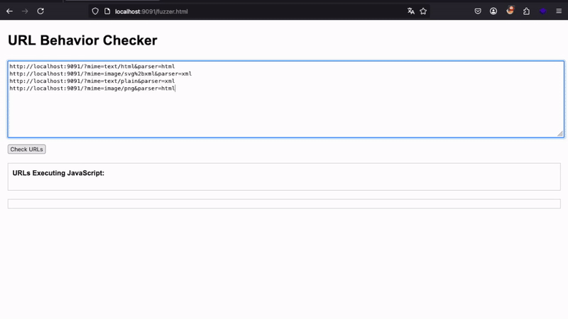

# NEW Mime-types that can execute XSS when using nosniff

| Safari iOS | Format | Notes |
|-------------------------------|--------|-------|
| model/vnd.usdz+zip            | HTML   | Only works if loaded inside an iframe as src |
| video/mp2t                    | HTML   |

# XSS Mime-Type Fuzzer

This is the result of a research I have done to exploit an XSS vulnerability in a file uploade functionality. When testing the target application, I noticed that they implement a blacklist of mime-types to prevent malicious HTML/XML from being loaded inside the application.
The blacklist was very good and contemplete all types listed in this repository https://github.com/BlackFan/content-type-research/blob/master/XSS.md from [@Black2Fan](https://x.com/black2fan?lang=ja).

I then decide to start fuzzing web browsers to look for new mime-types that can be used to execute XSS attacks and are not yet known by the security community. Doing so, I found 2 mime-types that can be used to execute XSS in Safari mobile.

The 2 new ones that are not known are **video/mp2t** and **model/vnd.usdz+zip** (this one must be chained with a Clickjacking vulnerability) that work on Safari for iOS.

# How to fuzz

To fuzz for new content-type you must start a PHP web server with the following command:
```bash
php -S localhost:9091
```

Then you can access the page http://localhost:9091/fuzzer.html and paste a list of URL's that will be used for the fuzzer, you can use the already made index.php file and send the URL's using the following format, where mime is the Content-Type you want the application to send in the response and parser will be the format you want the XSS payload to be, it can be html or xml:

```
http://localhost:9091/?mime=text/html&parser=html
http://localhost:9091/?mime=image/svg%2bxml&parser=xml
```

Remember to url encode every '+' sign  (%2b).

In the wordlist directory is the list that I used as source during the fuzzing.



NOTE: The browser will try to download some files (because of some content-type) so you should block downloads in your browser settings before running the fuzzer.

